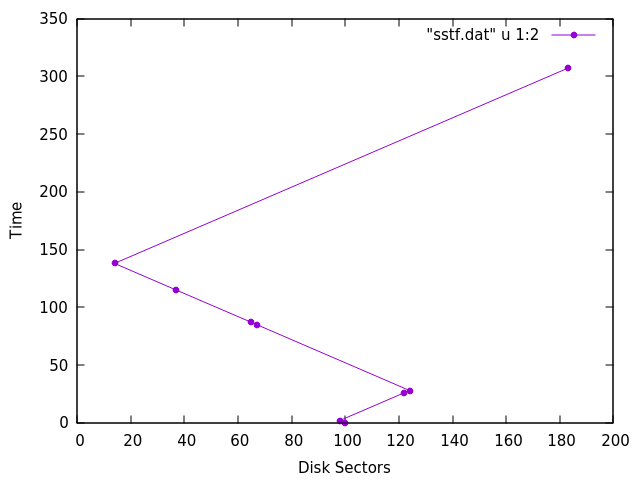

Name : Priyanka Sachan  
Roll Number : 1901CS43  
Operating Systems Lab (CS342)  

# ASSIGNMENT-11

## Problem 1
g++ p.cpp -o p
```
sachan@CLOUD-DESK:~/Documents/VI Semester/CS341 Operating Systems/Lab/Lab 11$ ./p
8
98 183 37 122 14 124 65 67

FCFS
 Seek time: 2985 ms
(2)98 -> (87)183 -> (233)37 -> (318)122 -> (426)14 -> (536)124 -> (595)65 -> (597)67
SCAN
 Seek time: 1495 ms
(2)98 -> (33)67 -> (35)65 -> (63)37 -> (86)14 -> (100)0 -> (222)122 -> (224)124 -> (283)183 -> (299)199
C-SCAN
 Seek time: 1275 ms
(2)98 -> (33)67 -> (35)65 -> (63)37 -> (86)14 -> (194)122 -> (196)124 -> (255)183
SSTF
 Seek time: 1535 ms
(2)98 -> (26)122 -> (28)124 -> (85)67 -> (87)65 -> (115)37 -> (138)14 -> (307)183

sachan@CLOUD-DESK:~/Documents/VI Semester/CS341 Operating Systems/Lab/Lab 11$ gnuplot
gnuplot> set xlabel "Disk Sectors"
gnuplot> set ylabel "Time"
gnuplot> plot "fcfs.dat" u 1:2 w linespoints pt 7
gnuplot> plot "scan.dat" u 1:2 w linespoints pt 7
gnuplot> plot "c-scan.dat" u 1:2 w linespoints pt 7
gnuplot> plot "sstf.dat" u 1:2 w linespoints pt 7
```

## Graphs Attached:

### FCFS

### SCAN

### C-SCAN

### SSTF

---