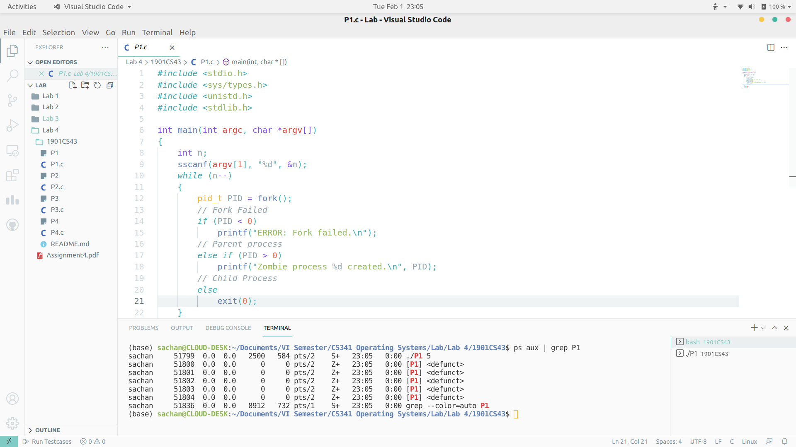
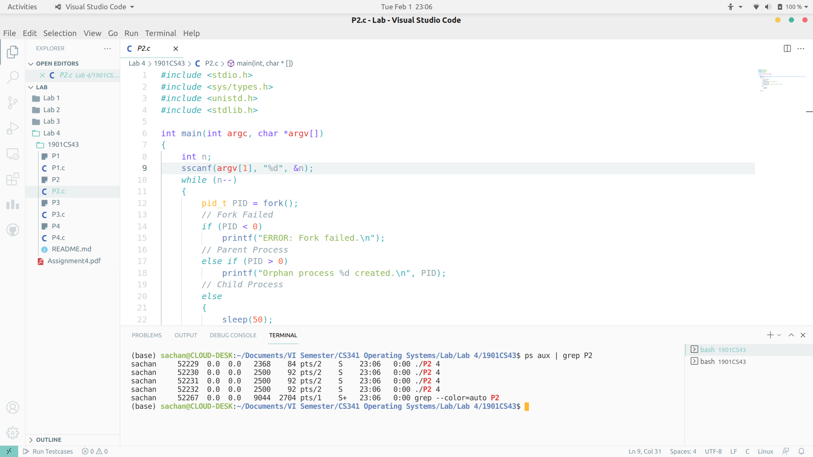

# ASSIGNMENT-4

### Problem 1
gcc P1.c -o P1
```
> ./P1 5
Zombie process 51800 created.
Zombie process 51801 created.
Zombie process 51802 created.
Zombie process 51803 created.
Zombie process 51804 created.
```

---

### Problem 2
gcc P2.c -o P2
```
> ./P2 4
Orphan process 52229 created.
Orphan process 52230 created.
Orphan process 52231 created.
Orphan process 52232 created.  
```

---

### Problem 3
gcc P3.c -o P3 
```
> ./P3 20
2 1 3 4 7 11 18 29 47 76 123 199 322 521 843 1364 2207 3571 5778 9349 
```
---

### Problem 4
gcc P4.c -o P4
```
> ./P4 prog.txt
#include <stdio.h>
#include <stdlib.h>
#include <sys/types.h>
#include <unistd.h>

int main(int argc, char *argv[])
{
    char *filename = argv[1];
    pid_t PID;

    PID = fork();
    // Child : Copy source program to another file f2
    if (PID == 0)
    {
        FILE *fptr1 = fopen("P4.c", "r");
        FILE *fptr2 = fopen(filename, "w");
        char c = fgetc(fptr1);
        while (c != EOF)
        {
            fputc(c, fptr2);
            c = fgetc(fptr1);
        }
        fclose(fptr1);
        fclose(fptr2);
        exit(0);
    }

    // Waits for child processes to terminate
    while (wait(NULL) > 0)
        ;
    PID = fork();
    // Child : Print contents of f2
    if (PID == 0)
    {
        FILE *fptr = fopen(filename, "r");
        char c = fgetc(fptr);
        while (c != EOF)
        {
            putc(c, stdout);
            c = fgetc(fptr);
        }
        fclose(fptr);
        exit(0);
    }

    // Waits for child processes to terminate
    while (wait(NULL) > 0)
        ;
    PID = fork();
    // Child : Delete file f2
    if (PID == 0)
    {
        remove(filename);
        exit(0);
    }
    return 0;
```
---
